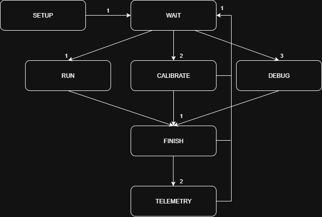

# Bally Software - Robô ESP32-S3

Este projeto implementa o controle de um robô baseado em ESP32-S3, utilizando arquitetura orientada a objetos, FreeRTOS, comunicação ESP-NOW e execução paralela em dois núcleos.

> **Compatibilidade:**
> Este software está sendo desenvolvido para ser totalmente compatível com o hardware documentado no repositório [bally_robot](https://github.com/AlisonTristao/bally_robot).

> **Telemetria com T-Dongle S3 (LilyGO):**
> Para realizar a telemetria via ESP-NOW, é utilizado o T-Dongle S3 da LilyGO como receptor dos dados. O código desenvolvido para enviar comandos e logs do robô para o dongle está disponível em: [t_dongle_develop](https://github.com/AlisonTristao/t_dongle_develop).

## Estrutura do Projeto

```
├── include/       # Cabeçalho das definições globais necessárias para configurar o robô
├── lib/           # Bibliotecas principais (sensores, controle, motores, logger, etc.)
├── robot/         # Implementação dos estados da máquina de estados
├── src/           # Código principal (main.cpp)
├── utils/         # Objetos estáticos e utilitários globais
├── platformio.ini # Configuração do PlatformIO
```

### Principais Módulos

- **ArraySensor**: Gerencia o array de sensores frontais, incluindo calibração, leitura e normalização dos valores.
- **Encoder**: Gerencia a leitura dos encoders usando periféricos de hardware do ESP32.
- **Format**: Header-only, sem dependências — formatação de tamanhos em bytes (`"12.34 MB"`) reaproveitada por SDCard, USBMassStorage e Logger.
- **HBridge**: Controle dos motores via ponte H, incluindo direção e PWM.
- **Logger**: Sistema de logs e comandos, com envio via ESP-NOW ou porta serial.
- **OTAUpdater**: Atualização de firmware sem fio a partir do estado DEBUG — conecta a uma rede Wi-Fi cadastrada no cartão SD e recebe o novo binário via HTTP.
- **RobotSettings**: Armazena e persiste (`settings.conf` no SD) todos os parâmetros configuráveis em runtime.
- **SDCard** / **USBMassStorage**: Acesso ao cartão SD e transferência de propriedade exclusiva do FAT entre o robô e um host USB.
- **StateMachine**: Máquina de estados do robô, com transições e *callbacks* configuráveis.
- **SystemMonitor**: Relatório opcional de saúde do sistema (CPU, memória, temperatura), habilitado por `ENABLE_SYSTEM_MONITOR`.
- **StaticObjects**: Inicializa e centraliza instâncias globais dos principais objetos (robô, sensores, motores, logger, etc.).
- **TinyShell**: Interpretador de linha de comando embarcado. Organiza comandos em módulos, suporta autocompletar (*auto-completion*), converte dinamicamente os tipos de argumentos de *strings* para os tipos esperados, valida a execução e lida com erros de forma segura (*try-catch*).

### Outras Pastas
- **robot/**: Implementação dos estados (Setup, Wait, Calibrate, Debug, Run, Finish, Telemetry, Error).
- **include/**: Definições globais necessárias para configurar o robô.
- **utils/**: Contém as configurações globais das funcionalidades do robô, centralizadas no objeto `ROBOT`, que permite criar apenas uma instância. Esse objeto unifica o acesso aos sensores, motores, utilidades dos sensores, logger, controle e demais recursos.

### Organização e Acoplamento entre Módulos

Cada pasta em `lib/` é compilável e compreensível isoladamente. Duas regras mantêm isso:

1. **Dependência entre bibliotecas só quando justificada, e sempre explícita.** A maioria dos módulos (`Flags`, `StateMachine`, `HBridge`, `Encoder`, `ArraySensor`, `SystemMonitor`, `Format`) não inclui nenhuma outra biblioteca do projeto. Onde uma dependência é real — `Logger` grava no `SDCard`; `OTAUpdater` usa `SDCard`/`Flags_out`; `USBMassStorage` usa `SDCard` — o header só faz `class Nome;` (forward declaration) e o `.cpp` inclui o header completo. Isso limita o acoplamento à implementação, não à interface pública: quem só usa a classe por referência/ponteiro nunca precisa saber o que ela inclui por baixo.
2. **`RobotSettings` não depende de nenhum outro módulo do projeto.** É a camada mais "de baixo" da configuração em runtime (dados + persistência em `settings.conf`); quem lê valores dela (`OTAUpdater`, `ArraySensor`, `Logger`, ...) depende dela, nunca o contrário. Os valores padrão compartilhados com o `OTAUpdater` (tempos, canal do ESP-NOW, ...) vivem em `lib/OTAUpdater/OtaDefaults.h`, um header sem nenhuma dependência que os dois incluem.

**Comandos de shell: cada módulo registra os próprios.** Toda classe que expõe comandos de shell implementa `register_shell_commands(TinyShell&, ...)` no seu próprio `.cpp`, recebendo por parâmetro só o que precisa (ex.: `OTAUpdater::register_shell_commands` recebe `Logger&`, `SDCard&`, `USBMassStorage&` e um `std::function<bool()>` para consultar se algum teste de DEBUG está ativo — sem precisar saber que "teste de DEBUG" é um conceito do `ROBOT`). `ROBOT::startWrappers()` (`utils/BallyRobot/BallyRobot.cpp`) é só a lista dessas chamadas de composição.

Três módulos de shell moram no próprio `ROBOT` (`registerRobotIOCommands`/`registerKalmanCommands`/`registerDebugCommands`, em `utils/BallyRobot/BallyRobot.cpp`), por não terem dono natural fora dele:
- **`robot`** (btn/ssr/set_pwm/set_led): aciona os `Flags_in`/`Flags_out`/`Flags_pwm` que o próprio `ROBOT` compõe; não há uma biblioteca "dona" além dele.
- **`kalman`** (estado do EKF + log periódico): o filtro (`TinyEKF`) é uma dependência externa vendorizada, sem wrapper próprio no `lib/`; quem possui a instância, o timer de amostragem e os vetores de controle/medição é o `ROBOT`.
- **`debug`** (`test_arr_sensor`/`test_encoder`): o agendamento e o *gate* (estado DEBUG + USB ocioso) são aplicados uniformemente sobre vários sensores a partir de estado privado do `ROBOT`, não pertencem a nenhum sensor individual.

`ROBOT`/`BallyRobot` é o *composition root*: o único lugar que conhece e instancia todos os subsistemas. Ele não contém a lógica de negócio de nenhum deles.

## Fluxo Detalhado do Sistema

O funcionamento do robô é dividido em duas partes principais, aproveitando os dois núcleos do ESP32-S3:

### Núcleo 1 (Core APP) — Execução Prioritária
O `void loop` roda exclusivamente no núcleo 1, especializado em executar a função principal de cada estado da máquina de estados. Isso garante que as funções críticas do robô tenham prioridade máxima, sem dividir processamento com tarefas paralelas.

### Núcleo 0 (Core PRO) — Processamento Paralelo
No segundo núcleo, é executada a rotina paralela do robô, responsável por:
- Verificar as *flags* dos botões, sensores laterais, sinais PWM e LEDs.
- Gerir as transições da máquina de estados, de acordo com as *flags*.
- Gerenciar a fila de comandos recebidos por ESP-NOW.
- Quando um pacote é recebido por ESP-NOW, ele é adicionado a uma fila; o processamento paralelo identifica o recebimento e repassa o conteúdo ao **TinyShell**, que realiza o *parse*, processa caracteres de escape, valida os argumentos necessários, executa a função C/C++ vinculada e formata a resposta de sucesso ou o código de erro.
- Gerenciar o Filtro de Kalman Estendido, fazendo a amostragem, o cálculo de predição e a atualização do estado. 

---

### Comunicação
- **ESP-NOW:** Utilizado para comunicação sem fio entre robôs/controladores, envio de logs e comandos.

#### Logger (Telemetria e Debug)
Para criar uma maneira robusta de *debug* e envio de mensagens de telemetria usando ESP-NOW, o projeto utiliza uma biblioteca própria de logger:

- As mensagens de log são salvas na PSRAM (que disponibiliza 8 MB octal no chip utilizado), em um array cíclico.
- Cada log é uma *struct* que contém:
  - O tempo em milissegundos em que a mensagem foi adicionada.
  - O tipo da mensagem (INFO, ERROR, CMD, TELEMETRY, etc.), permitindo filtragem e priorização (por exemplo, utilizando a macro `#ifndef`, podemos desativar os logs e melhorar a eficiência do código).
  - O número do pacote, caso o conteúdo da mensagem ultrapasse o limite de 250 bytes do ESP-NOW (mensagens grandes são fragmentadas).
- Ao utilizar o método `flush`, os logs são enviados em tempo real para o endereço MAC definido, via ESP-NOW.
- Caso o ESP-NOW não consiga inicializar, ou para *debug* local, é possível redirecionar os logs para a porta serial, alterando a função de *callback* no `setup`.

### Flags (Eventos Temporizados e Segurança)
O projeto utiliza uma biblioteca de *flags* para facilitar a gestão de eventos temporizados e garantir segurança no controle dos atuadores:

- É possível definir um valor booleano (HIGH ou LOW) para cada *flag*, válido por um tempo determinado.
- No núcleo secundário, o sistema verifica periodicamente o tempo de cada *flag* e reseta automaticamente aquelas que expiraram.
- Isso permite notificar eventos disparados em interrupções (como botões ou sensores) de forma global.
- Para sinais de saída (*output*), também utilizamos *flags*: quando uma função deixa de enviar o sinal, a *flag* é desativada automaticamente, evitando que atuadores (motores, LEDs, etc.) fiquem ligados por tempo indeterminado.

### Máquina de Estados
O robô é controlado por uma máquina de estados robusta, com funcionamento definido em tempo de compilação:

- A máquina de estados possui um número fixo de estados, definidos em enumeração no código (ex: SETUP, WAIT, CALIBRATE, DEBUG, RUN, FINISH, TELEMETRY, ERROR).
- Cada estado possui:
  - Uma função principal (*main*) que é executada com prioridade máxima no loop principal (núcleo 1).
  - Uma função de verificação de transição, que avalia as condições (*flags*, sensores, comandos) para decidir se o estado deve mudar.
- Caso ocorra qualquer problema na gestão dos estados (ex: função não definida, erro de transição), a máquina de estados automaticamente coloca o sistema no estado ERROR e notifica o erro no logger, garantindo segurança e rastreabilidade.
- Tanto as funções principais quanto as de transição podem ser customizadas conforme a aplicação.

## Dependências externas

- **TinyShell** (adicionada via `lib_deps` no platformio.ini):
  Usado para a interpretação de comandos textuais de telemetria. Oferece:
  - Validação do módulo, nome do comando e número de argumentos.
  - Conversão dinâmica de *strings* com parâmetros de escape.
  - Execução de funções em tempo de execução do código.
- **TinyEKF** (adicionada via `lib_deps` no platformio.ini):
  Usado para estimar a velocidade linear e angular do robô, considerando uma dinâmica diferencial. Oferece:
  - Script em Python que otimiza o modelo não linear e desenrola o cálculo de multiplicações de matrizes.
  - Estimativa ótima dos estados, considerando a velocidade angular e linear.
  - Permite utilizar qualquer modelo; contudo, para este projeto, utilizamos acelerômetro, giroscópio e 2 encoders.

## Diagrama da Máquina de Estados



---
Projeto desenvolvido por Alison Tristão.